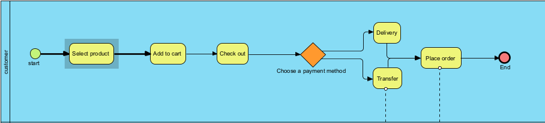
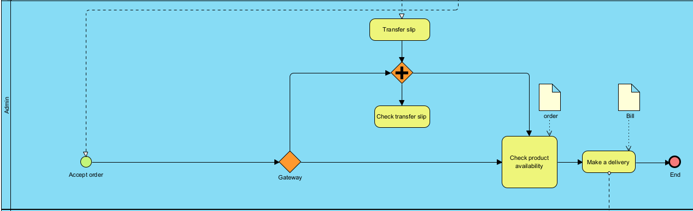
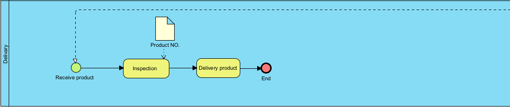
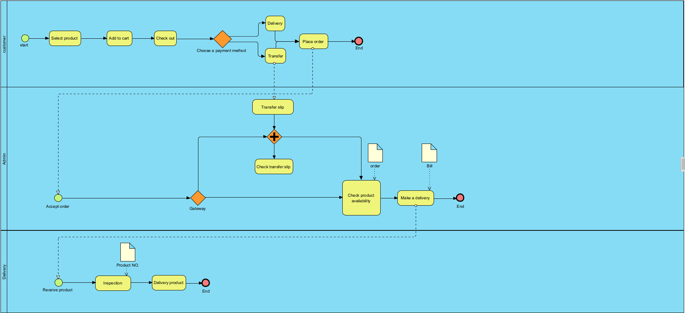

# Modern-Ecommerce-Platforms
Project name : Modern E-commerce Platform
My name : Fitree Chelong
Student Id : 631431007
Student of Information and Technology

**Abstract**
  This project involves creating a simple modern e-commerce platform using Wordpress forms and includes modeling of business process systems from customer until delivery.

**Table of Content** 
- Summary and Synopsis of the Project
- Introduction
- Discussion and Details
- Conclusion
- Recommendations

**Summary and Synopsis of the Project**
  This project is about making an e-commerce website and practicing creating a small business model using Wordpress to create a website. Which is my business A website about selling things like suits, shoes, hats, etc. Creating a website this time has many helpers that are important keys such as Laragon, wordpress, Visual Paradigm etc.

Introduction
Before we get into the business process part. Let's get to know the main keys that are important in creating an e-commerce website.

**1 Laragon**
Laragon is a portable, isolated, fast & powerful universal development environment for PHP, Node.js, Python, Java, Go, Ruby. It is fast, lightweight, easy-to-use and easy-to-extend.
[Laragon](https://laragon.org/docs/index.html)

**2 Wordpress**
At its core, WordPress is the simplest, most popular way to create your own website or blog. In fact, WordPress powers over 43.3% of all the websites on the Internet. Yes – more than one in four websites that you visit are likely powered by WordPress.
What Is WordPress? Explained for Beginners [Wordpress](kinsta.com)

**3 Visual Paradigm**
Visual Paradigm is a leading and globally recognized provider for Business and IT Transformation software solutions. It enables organizations to improve business and IT agility and foster innovation through popular open standards. Our award-winning products are trusted by over 320,000 users in companies ranging from small business, consultants, to blue chip organizations, universities and government units across the globe. About Visual Paradigm [Visual Paradigm](visual-paradigm.com)

**Why did I choose to use these three strategies to build an e-commerce website?**

Why did I choose to use these three strategies to build an e-commerce website?
For Laragon, first of all it is convenient. Easy to use and free.
For Wordpress, it is a widely known form, easy to use, no coding required, and fast.
And finally, Visual Paradigm is a good program. And there is a complete modeling process.

Steps for creating an e-commerce website

The first thing is to download the 3 programs that are the main keys like mentioned above.

- Laragon
- Wordpress
- Visual Paradigm

My business model starts with:
customer
admin
delivery

Please note that this model is not complete and my own business is a small business with me as admin and taking care of my own stock. That's like what you see in the model, which will see that the admin takes care of both the front of the house and the back of the house.

# Let's start with the first picture:

The first image will be in the customer section.
My website is not complicated at all. where customers can come in and see the product and place an order with 2 payment channels funnel together One is pay-on-delivery and the second is pay-to-account. If already selected, customers can click to order immediately.

# And in the second section is the admin part:

As for the admin, it will accept orders from customers who order. By purchasing, it can come in the form of pay-on-delivery or it can come in the form of a transfer as well. Therefore, if looking in the picture, we will see that we will clearly split into 2 channels by using a gateway to divide. and we can see that The first way is to transfer that we will have to check the transfer slip before we prepare and deliver the item itself. And after that it will be in the part of the delivery to the courier. We will have a bill to inform the customer (But we do not specify it in the model that appears here).

# And the last part will be the delivery:

In this last part, we can see that there are not many steps. The delivery company will have a duty to receive products from us, after which they will inspect the product and bring it to the parcel number and finally it will be delivered to the customer who has ordered.

As I said, it's still not 100% complete, but it's enough to see the possibility of doing a small business.

Which we have not yet specified in the model Mainly it will be in the part of tracking the customer's products and the communication between the customer and the courier company.
And here's the final picture of how my business model works (halfway through).

