# Modern-Ecommerce-Platforms
Project name : Modern E-commerce Platform
My name : Fitree Chelong
Student Id : 631431007
Student of Information and Technology

## Abstract
 This project involves creating a simple modern e-commerce platform using Wordpress forms and includes modeling of business process systems from customer until delivery.

## Project overview
  This project is about making an e-commerce website and practicing creating a small business model using Wordpress to create a website. Which is my business A website about selling things like suits, shoes, hats, etc. Creating a website this time has many helpers that are important keys such as Laragon, wordpress and Visual Paradigm.

## Software use

**1 Laragon**
Laragon is a portable, isolated, fast & powerful universal development environment for PHP, Node.js, Python, Java, Go, Ruby. It is fast, lightweight, easy-to-use and easy-to-extend.
[Laragon](https://laragon.org/docs/index.html)

**2 Wordpress**
At its core, WordPress is the simplest, most popular way to create your own website or blog. In fact, WordPress powers over 43.3% of all the websites on the Internet. Yes – more than one in four websites that you visit are likely powered by WordPress.
What Is WordPress? Explained for Beginners [Wordpress](kinsta.com)

**3 Visual Paradigm**
Visual Paradigm is a leading and globally recognized provider for Business and IT Transformation software solutions. It enables organizations to improve business and IT agility and foster innovation through popular open standards. Our award-winning products are trusted by over 320,000 users in companies ranging from small business, consultants, to blue chip organizations, universities and government units across the globe. About Visual Paradigm [Visual Paradigm](visual-paradigm.com)

**Why did I choose to use these three strategies to build an e-commerce website?**

I choose to use these three strategies to build an e-commerce website?
For Laragon, first of all it is convenient. Easy to use and free.
For Wordpress, it is a widely known form, easy to use, no coding required, and fast.
And finally, Visual Paradigm is a good program. And there is a complete modeling process.

## Steps for have an e-commerce website
You can follow this video [Click](https://www.youtube.com/watch?v=0eeld9jH1Tk)

**My Web look like**

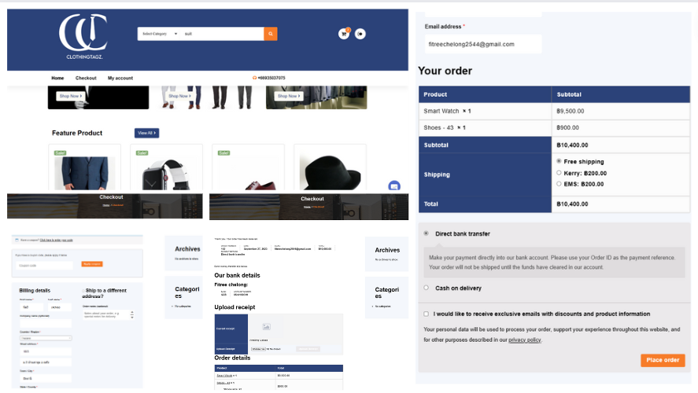

**There will be main functions as follows.**
- Customer views products/searches for desired products
- Add to cart
- Check out products
- Use discount coupons
- Choose payment method
- product orders

And of course, to have those functions or features, there must be a plug-in to help.

**The main plugins that we use are as follows.**
- WooCommerce [More](https://wordpress.org/plugins/woocommerce/.com)
- WooCommerce PDF Invoices & Packing Slips Thai Language Pack (Adds Thai font (Norasi) to WooCommerce PDF Invoices & Packing Slips)
- PDF Invoices & Packing Slips for WooCommerce  [More](https://wordpress.org/plugins/woocommerce-pdf-invoices-packing-slips/)
- PeproDev WooCommerce Receipt Uploader [More](https://wordpress.org/plugins/pepro-bacs-receipt-upload-for-woocommerce/)
- Chaty (Chat with your website visitors via their favorite channels. Show a chat icon on the bottom of your site and communicate with your website visitors.)[More](https://wordpress.org/plugins/chaty/)
  
## BPMN Diagram

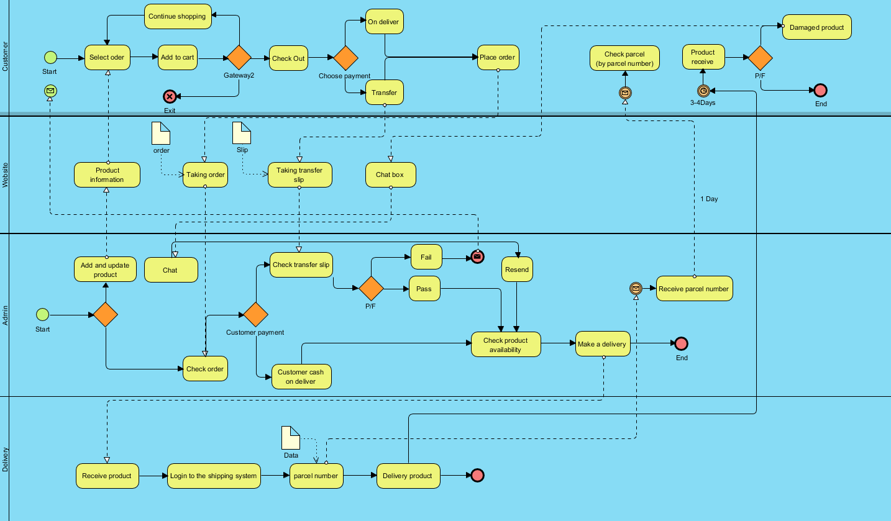

## Customer part

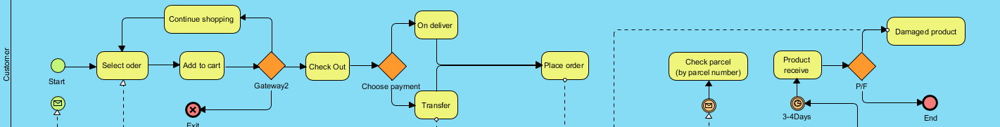

**We start form customer process. When customer use our site they can chose any product and add to cart or they can chose to reshopping or exit the site**
- If customer exit the site is end.
- If customer reshopping it'll go to shopping again with shop page.
- If customer go to check out it'll go to the step that choes payment method and go to order the product and end.

**Check product status**
- Customer can check product status with percen namber and check in web and they also can check product slip in website too.

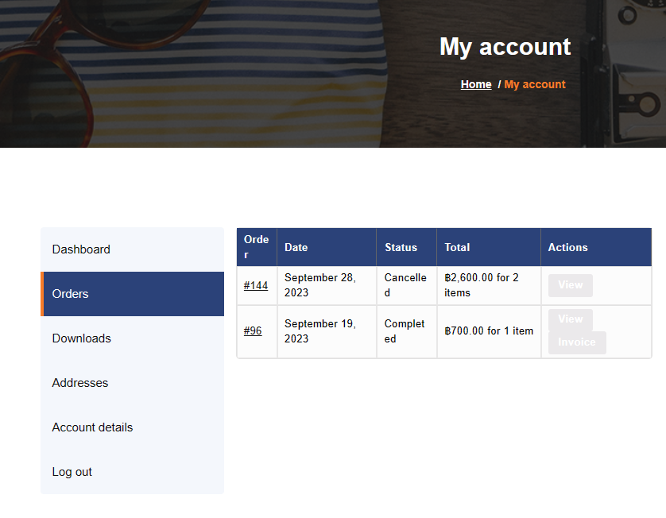

**Receive product**
- After customer wait the product for 3 days they have to check that product is good or bad if have some problem they can contect with admin through chat box and it'll go to another process later.

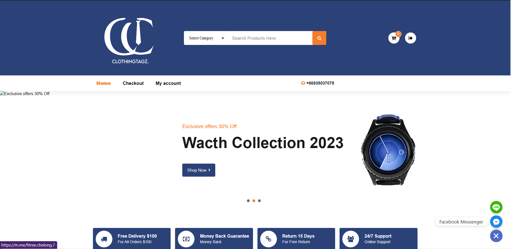

## Website part
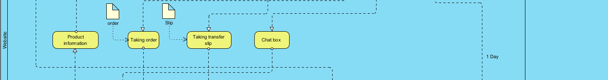

**For website it is the center between customer and admin.**
- Start form the first that is **product information** is that can make customer choes it.
- Second is taking customer order before the data go to backend.
- Third is taking slip from customer who choes transfer before the data go to backend.
- Last one is chat box it's what the customer can use to contect with admin.

## Admin part
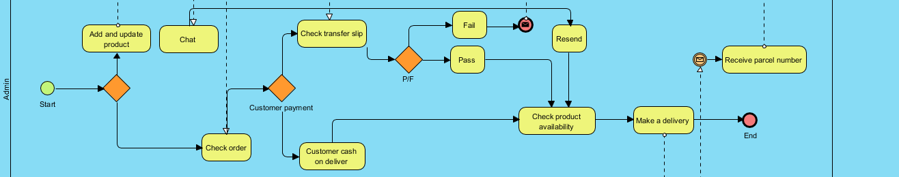
**Admin process**
- First we go to start even.
- When admin come to thier system they can choes what they want to work there are alot of choice actully.

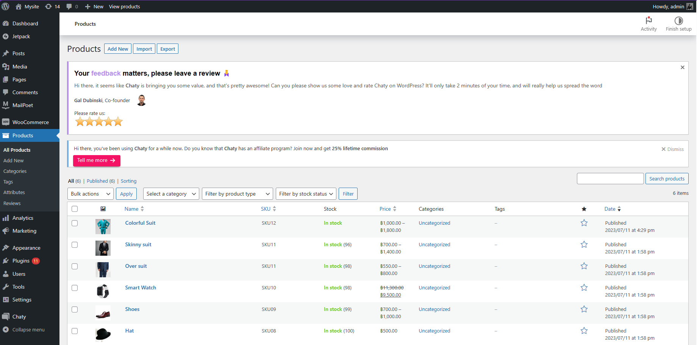

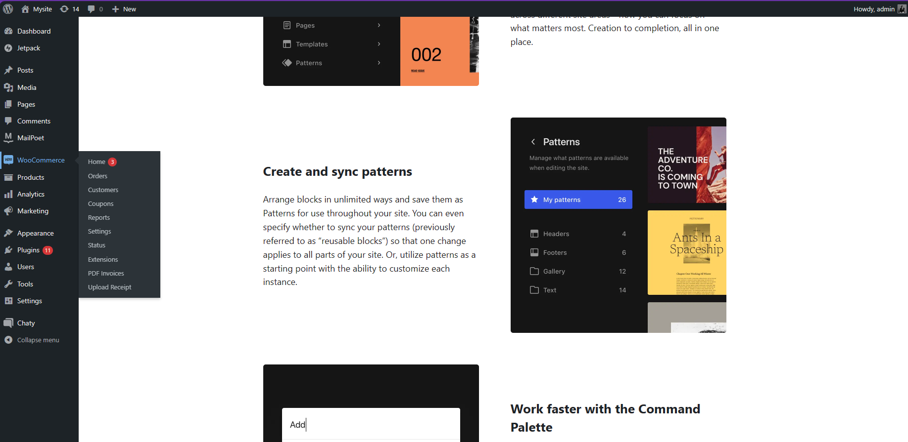

- if they choes for add product information or dev web is ecffect to web.
- if they choes chat they'll go to chat space.
- When they see customer order they can go to check it until deliver.
- For order checking admin can check what customer choes for payment if cash on deliver it will be on process but if customer choes to transfer admin can check transfer slip it pass or fail. If pass is on process if fail admin will notify to customer to transfer or choes payment again.

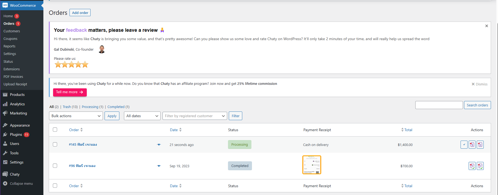

- Last one is admin have to taking pecel number and give it to customer.

## Delivery part
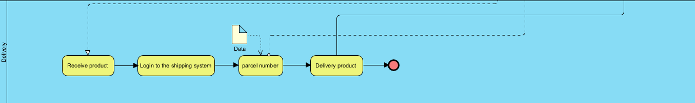
**Delivery process**
- First delivery taking customer product from admin.
- And put in in their system
- Make a pacel number (Give to admin)
- And sent product to customer (receive money from customer for who choes cash on deliver)

## Work Process

Agile methodology is a project management and product development approach that prioritizes simplicity, collaboration, and the ability to respond to customer needs and changes quickly. It is based on the idea of breaking down a project or development into short, iterative cycles, where each cycle produces a usable product or software feature that can be tested and used. Here are some key principles of Agile:

- Collaboration: Agile encourages close collaboration between the development team and the customer, emphasizing communication and working together closely.

- Iterative and Incremental: Agile divides the project into short cycles, and each cycle produces a small piece of the product, gradually increasing its completeness.

- Flexibility: Agile allows for changing requirements and project scope during development, enabling teams to adapt to evolving needs.

- Testing and Evaluation: Continuous testing and evaluation allow for feedback and continuous improvement throughout the project.

- Deliver Customer Value: Agile focuses on delivering real customer value in short timeframes, ensuring that the product is meaningful to the customer.

- Scrum and Kanban: Agile often employs frameworks like Scrum and Kanban to manage and control work in an Agile way.

- Transparency: Agile promotes transparency by providing direct information and progress updates to everyone on the team.

- Continuous Improvement: Agile encourages ongoing learning and improvement through assessments and immediate delivery.

The success of Agile depends on proper implementation and adherence to its principles, and it is well-suited for projects that are complex or require flexibility in response to changing customer requirements.

## Conclusion
 For this e-commerce website, this website was created using a theme and made in my own style. For me, creating a website is no longer difficult because of the website creation I have presented here. It is created without writing code at all. 

