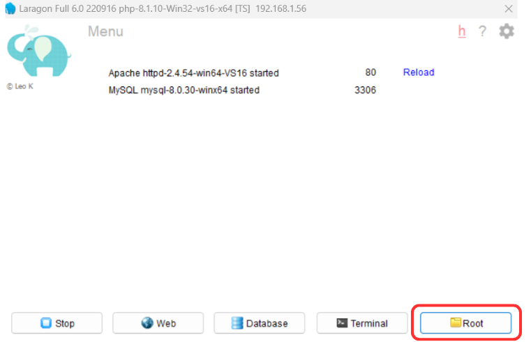
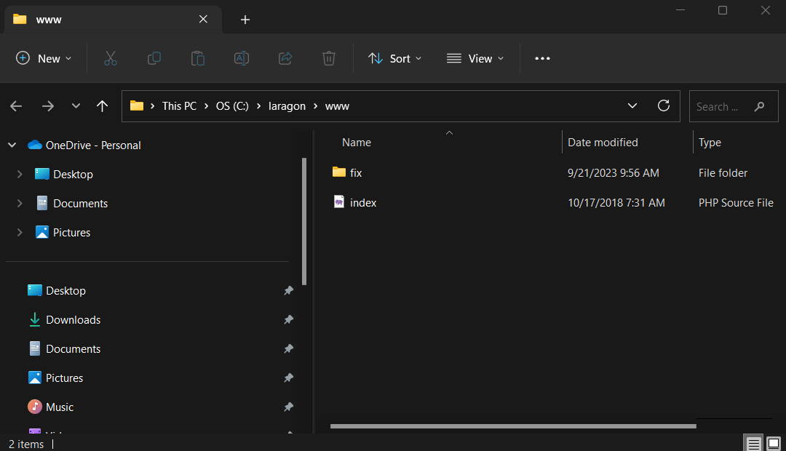
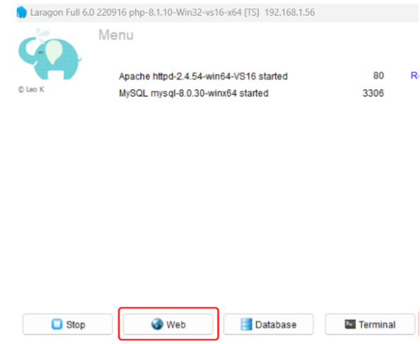
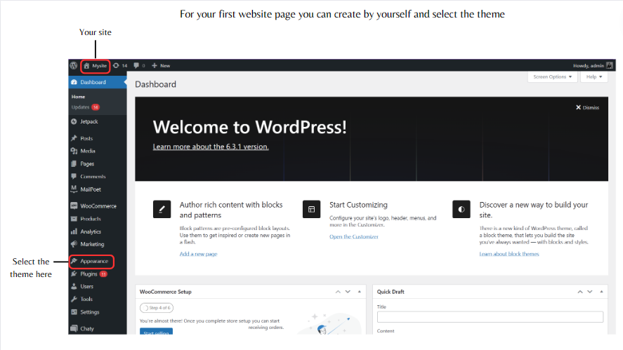

# Modern-Ecommerce-Platforms
Project name : Modern E-commerce Platform
My name : Fitree Chelong
Student Id : 631431007
Student of Information and Technology

## Abstract
 This project involves creating a simple modern e-commerce platform using Wordpress forms and includes modeling of business process systems from customer until delivery.

## Table of Content 
- Summary and Synopsis of the Project
- Introduction
- Discussion and Details
- Conclusion

## Summary and Synopsis of the Project
  This project is about making an e-commerce website and practicing creating a small business model using Wordpress to create a website. Which is my business A website about selling things like suits, shoes, hats, etc. Creating a website this time has many helpers that are important keys such as Laragon, wordpress, Visual Paradigm etc.

## Introduction
Before we get into the business process part. Let's get to know the main keys that are important in creating an e-commerce website.

**1 Laragon**
Laragon is a portable, isolated, fast & powerful universal development environment for PHP, Node.js, Python, Java, Go, Ruby. It is fast, lightweight, easy-to-use and easy-to-extend.
[Laragon](https://laragon.org/docs/index.html)

**2 Wordpress**
At its core, WordPress is the simplest, most popular way to create your own website or blog. In fact, WordPress powers over 43.3% of all the websites on the Internet. Yes – more than one in four websites that you visit are likely powered by WordPress.
What Is WordPress? Explained for Beginners [Wordpress](kinsta.com)

**3 Visual Paradigm**
Visual Paradigm is a leading and globally recognized provider for Business and IT Transformation software solutions. It enables organizations to improve business and IT agility and foster innovation through popular open standards. Our award-winning products are trusted by over 320,000 users in companies ranging from small business, consultants, to blue chip organizations, universities and government units across the globe. About Visual Paradigm [Visual Paradigm](visual-paradigm.com)

**Why did I choose to use these three strategies to build an e-commerce website?**

Why did I choose to use these three strategies to build an e-commerce website?
For Laragon, first of all it is convenient. Easy to use and free.
For Wordpress, it is a widely known form, easy to use, no coding required, and fast.
And finally, Visual Paradigm is a good program. And there is a complete modeling process.

## Inshot Steps for have an e-commerce website 
#### You can follow this video [Click](https://www.youtube.com/watch?v=0eeld9jH1Tk)

The first thing is to download the 3 programs that are the main keys like mentioned above.

- Laragon
- Wordpress
- Visual Paradigm

Once all three are loaded, open Laragon and select the root botton.

Create a new  file and put your wordpress in that file.

And go to Web with click (I'm already to install it take me to login page and done) 

And we come to the admin page(ฺBackend)

**My Web**

My website will be a website related to selling shirts or fashion clothing.

**There will be main functions as follows.**
- Customer views products/searches for desired products
- Add to cart
- Check out products
- Use discount coupons
- Choose payment method
- product orders

And of course, to have those functions or features, there must be a plug-in to help.

**The main plugins that we use are as follows.**
- WooCommerce [More](https://wordpress.org/plugins/woocommerce/.com)
- WooCommerce PDF Invoices & Packing Slips Thai Language Pack (Adds Thai font (Norasi) to WooCommerce PDF Invoices & Packing Slips)
- PDF Invoices & Packing Slips for WooCommerce  [More](https://wordpress.org/plugins/woocommerce-pdf-invoices-packing-slips/)
- PeproDev WooCommerce Receipt Uploader [More](https://wordpress.org/plugins/pepro-bacs-receipt-upload-for-woocommerce/)
- Chaty (Chat with your website visitors via their favorite channels. Show a chat icon on the bottom of your site and communicate with your website visitors.)[More](https://wordpress.org/plugins/chaty/)
  
**My business model**

## Conclusion
 For this e-commerce website, this website was created using a theme and made in my own style. For me, creating a website is no longer difficult because of the website creation I have presented here. It is created without writing code at all. 
